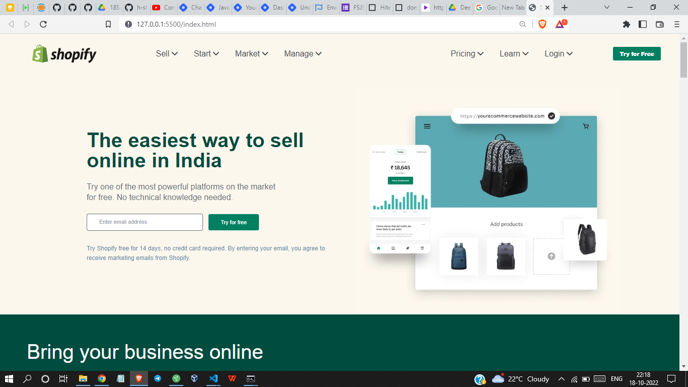
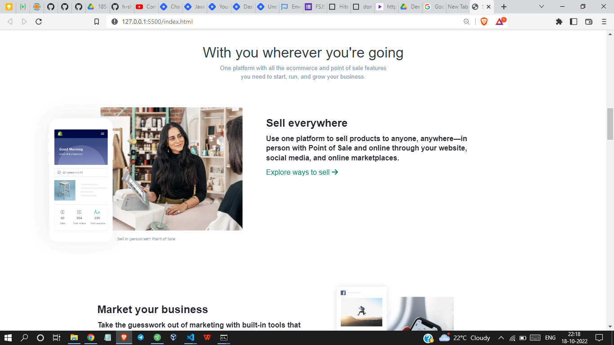
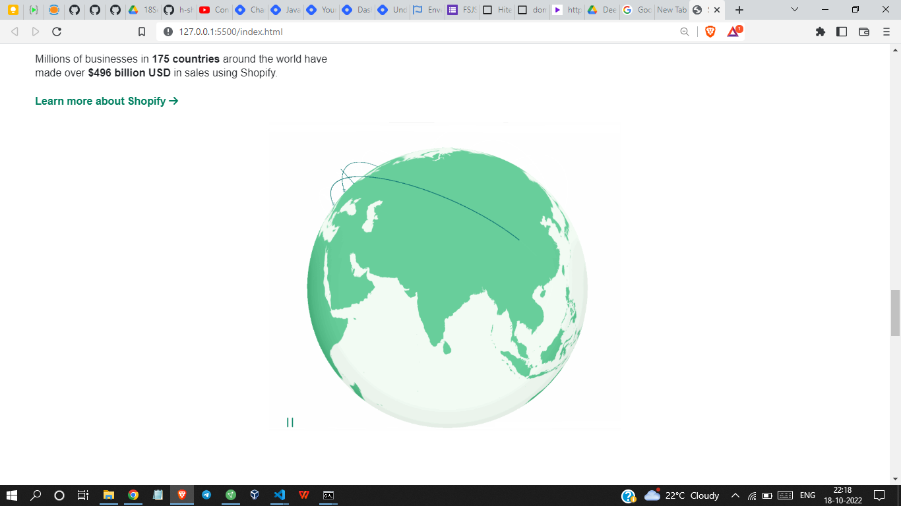
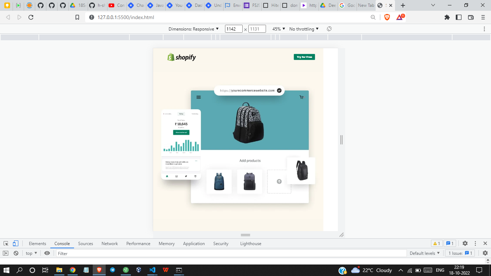

# Shopify Clone - HTML & Tailwind CSS

By Shreesha

Here's the Live Deployed Website 

## [DEPLOYED WEBSITE LINK](https://paytm-clone-tailwindcss-jsbootcamp.netlify.app/)

## What I learned from this Project?

- In this project I got to learn in depth of tailwind CSS.
- The website is also responsive.

## This project took around 10 hours to complete.